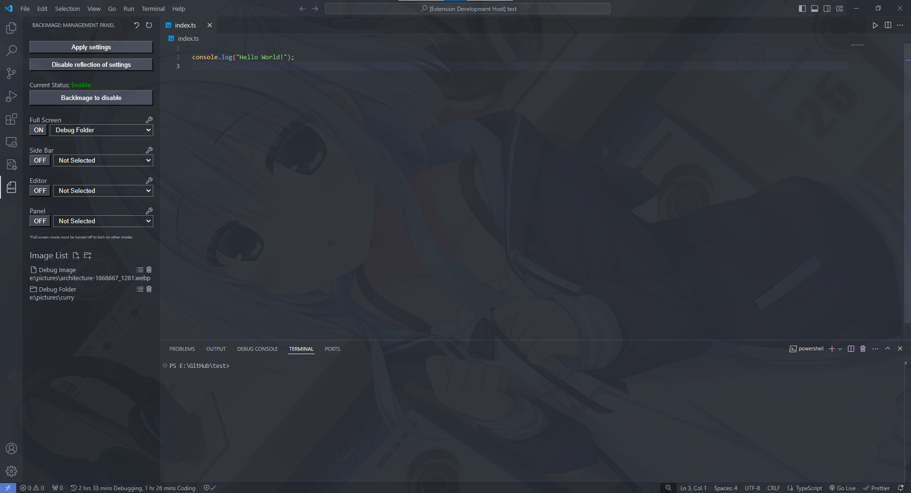
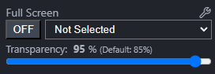
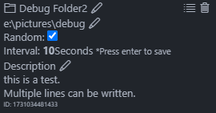

# VScode-BackImage

Visual Studio Code上で背景変更を出来るようにする拡張機能です。

#### 他言語: [English](./README.md) [日本語](./README.ja-JP.md)

### フルスクリーン

### サイドバー、エディター、パネルで別々の画像を指定

## 実際の操作

背景画像の設定には左側のタブでBackImageのアイコンを選択後にで出てくる操作パネルを使います。

#### 1: 画像リストを追加 (右:ファイル追加 左:ディレクトリ追加)

ディレクトリの場合は、その中の画像ファイルを数秒おきに反映します。

#### 2: 画像リストを選択 (背景のタイプごとに選択できます。)

未選択の場合は背景変更を有効化しても背景は何も変わりません。

#### 3: 背景変更を有効化

フルスクリーンをONにした場合、他はOFFから変更できなくなるので気を付けてください

フルスクリーンをOFFにすれば変更できるようになります。

#### 4: 拡張機能の有効化

#### 5: 設定の反映

### 他にも

#### 6: バグが起きた場合に使うボタン

拡張機能の無効化と内部のCSSやJSのリセットがされます。

これによって通常状態のVScodeに戻るのでバグなどもなくなると思います。

何かあった場合に使ってください

#### 透明度調整

設定ボタンを押すと出てくるUIを使って透明度を調整できます。

#### 画像リストの詳細な設定

ゴミ箱マークの右隣のボタンを押すことでフォルダの詳細な設定をすることが出来ます。

フォルダの名前と説明、ランダムに表示するか、画像一枚一枚の表示時間などを変更できます。

## 注意点

この拡張機能はWindows以外でのテストを行っていません。

もしVScodeが壊れた場合は再インストールすることを推奨します。

何故壊れる可能性があるかは[こちら](#なぜvscodeが壊れる可能性があるのか)をご覧ください。

使用は自己責任です。

## なぜVScodeが壊れる可能性があるのか

本来VScodeにはCSSを変更するAPIはありません

なのでこの拡張機能を含め背景変更系の拡張機能はVScodeのCSSやJSを書き換えることで無理やり機能を実装しています。

そのためOSやVScodeのバージョンなどの環境に左右されやすく、急に本拡張機能が使えなくなったり、VScode自体がうまく起動しなくなる可能性があります。

その場合は速やかにVScodeの最新バージョンを再インストールしてください。

再インストール時にCSSやJSが通常のものに上書きされるので壊れていても治ります。

## 開発について

IssueやPull Requestは基本的に英語で行ってください。

Commit Messageは何語でも構いませんがPull Requestの説明文に大雑把でもいいので各Commitの英訳を入れてください。

※開発者である[ROBOT](https://github.com/ROBOTofficial)は日本人で第一言語は日本語です。
英語等の対応は少々苦手です。
英文等に間違いがあった場合は優しく指摘していただければ幸いです。

現在、本拡張機能は日本語と英語のみの対応となっています。

他言語に翻訳をしていただける方が居ましたら翻訳していただけるとありがたいです。

またコードの最適化などに対するPull Requestも大歓迎です。

コードの最適化を求めている方は是非Pull Requestで開発に参加してください。

## 参考元

本拡張機能は以下の二つのリポジトリを参考に作られています。

### [vscode-background](https://github.com/shalldie/vscode-background)

### [vscode-background-cover](https://github.com/AShujiao/vscode-background-cover)

## 引用

### ©まどそふと

> 本拡張機能のREADMEにて、スクリーンショットで背景に [作品](https://madosoft.net/hamidashi/) を使用
