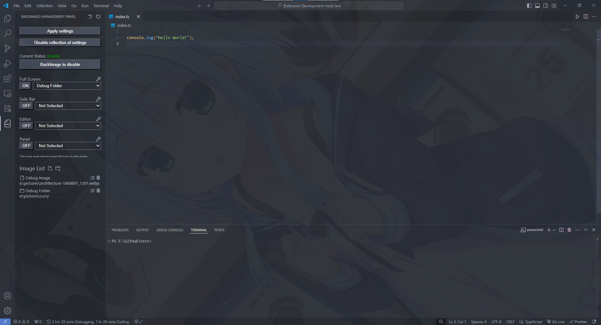
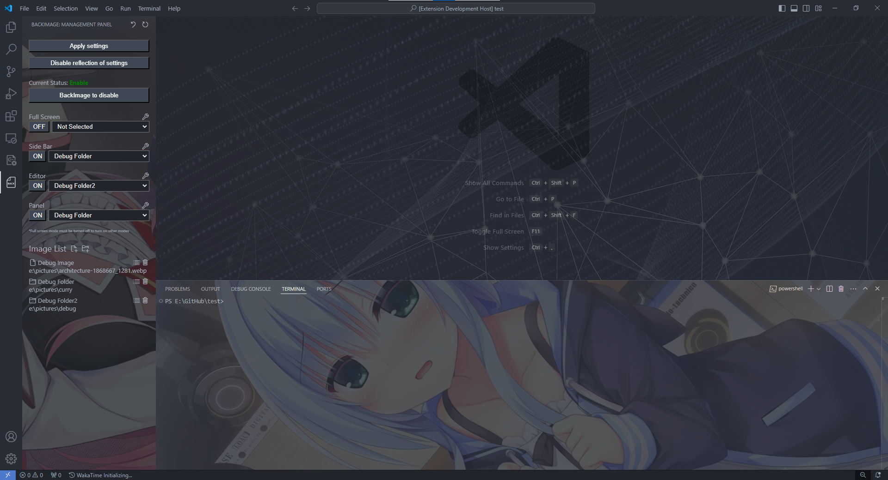
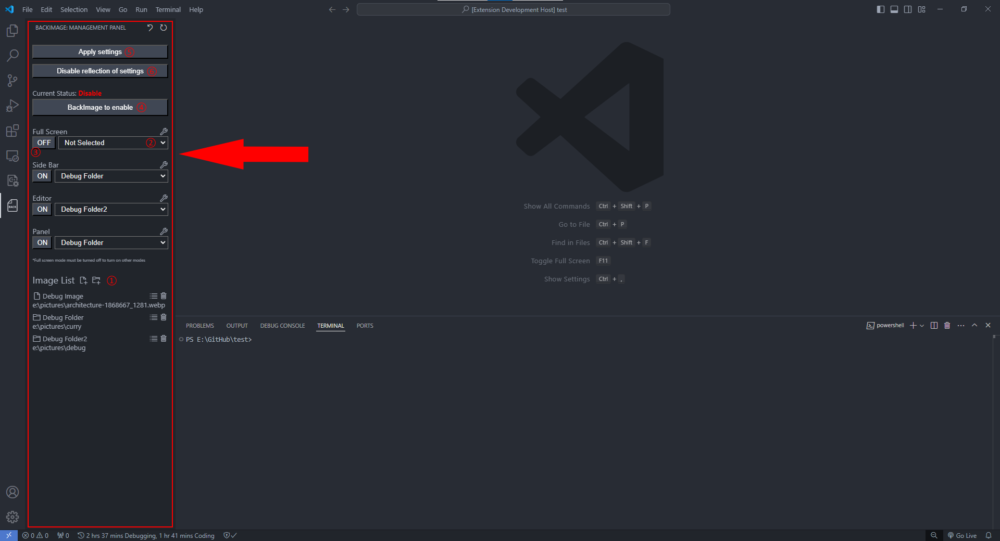
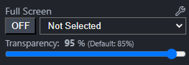
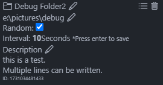

# VScode-BackImage

This is an extension that allows you to change the background in Visual Studio Code.

#### Other Languages: [English](./README.md) [日本語](./README.ja-JP.md)

### Full Screen

### Specify different images for the sidebar, editor, and panel

## Actual Operation

To set the background image, select the BackImage icon in the left tab and use the operation panel that appears.

#### 1: Add Image List (Right: Add File Left: Add Directory)

For directories, image files within will be reflected every few seconds.

#### 2: Select Image List (You can select for each type of background.)

If nothing is selected, the background will not change even if you enable background change.

#### 3: Enable Background Change

If you turn ON full screen, you will not be able to change other settings, so please be careful.

You can change it back to OFF to enable modifications.

#### 4: Enable the Extension

#### 5: Reflect Settings

### Additionally

#### 6: Button to Use in Case of Bugs

This will disable the extension and reset the internal CSS and JS.

This should return you to the normal state of VScode, eliminating any bugs.

Please use it if something happens.

#### Adjust Opacity

You can adjust the opacity using the UI that appears when you press the settings button.

#### Detailed Settings for Image List

By pressing the button next to the trash can icon, you can make detailed settings for the folder.

You can change the folder name and description, whether to display randomly, and the display time for each image.

## Notes

This extension has not been tested on platforms other than Windows.

If VScode becomes corrupted, it is recommended to reinstall it.

For reasons why it may become corrupted, please see [here](#why-vscode-may-be-corrupted).

Use at your own risk.

## Why VScode May Be Corrupted

VScode does not originally have an API to change CSS.

Therefore, background-changing extensions, including this one, forcibly implement functionality by rewriting VScode's CSS and JS.

As a result, it is susceptible to the environment, such as the OS and VScode version, and there is a possibility that this extension may suddenly become unusable or VScode itself may not start properly.

In that case, please promptly reinstall the latest version of VScode.

During reinstallation, the CSS and JS will be overwritten with the normal ones, so even if it is corrupted, it will be fixed.

## About Development

Please conduct issues and pull requests primarily in English.

Commit messages can be in any language, but please include a rough English translation of each commit in the pull request description.

*The developer, [ROBOT](https://github.com/ROBOTofficial), is Japanese and his first language is Japanese. He is somewhat not good at handling English and other languages. If there are any mistakes in the English text, kindly point them out.*

Currently, this extension only supports Japanese and English.

If anyone can translate it into other languages, it would be greatly appreciated.

Pull requests for code optimization are also very welcome.

If you are looking to optimize the code, please participate in development through pull requests.

## References

This extension is created based on the following two repositories.

### [vscode-background](https://github.com/shalldie/vscode-background)

### [vscode-background-cover](https://github.com/AShujiao/vscode-background-cover)

## Citation

### ©まどそふと

> The background in the screenshots in this extension's README uses [the work](https://madosoft.net/hamidashi/).
